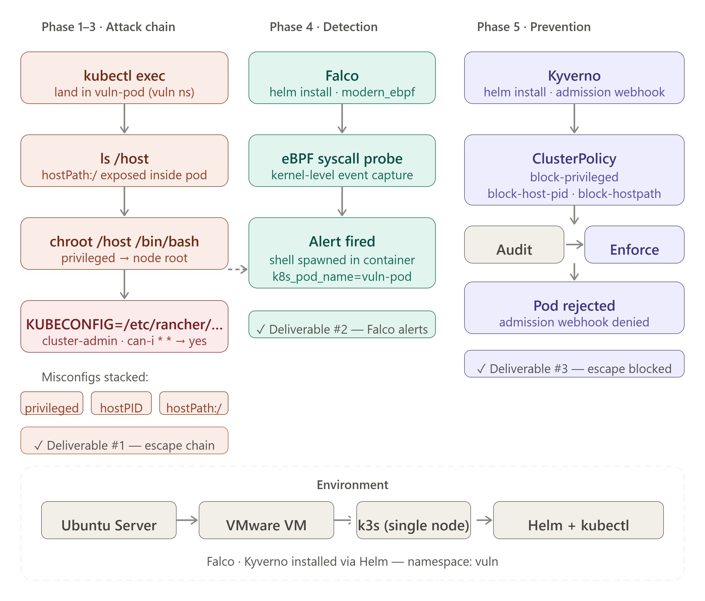
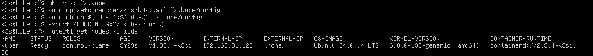
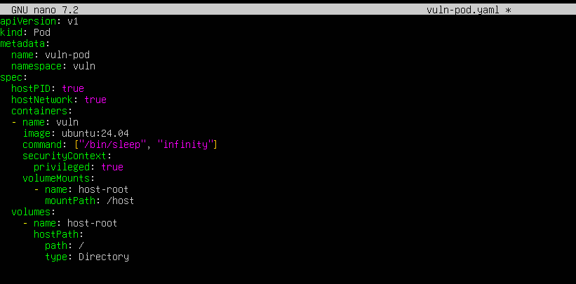
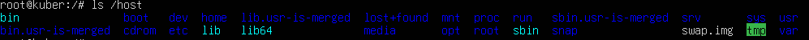
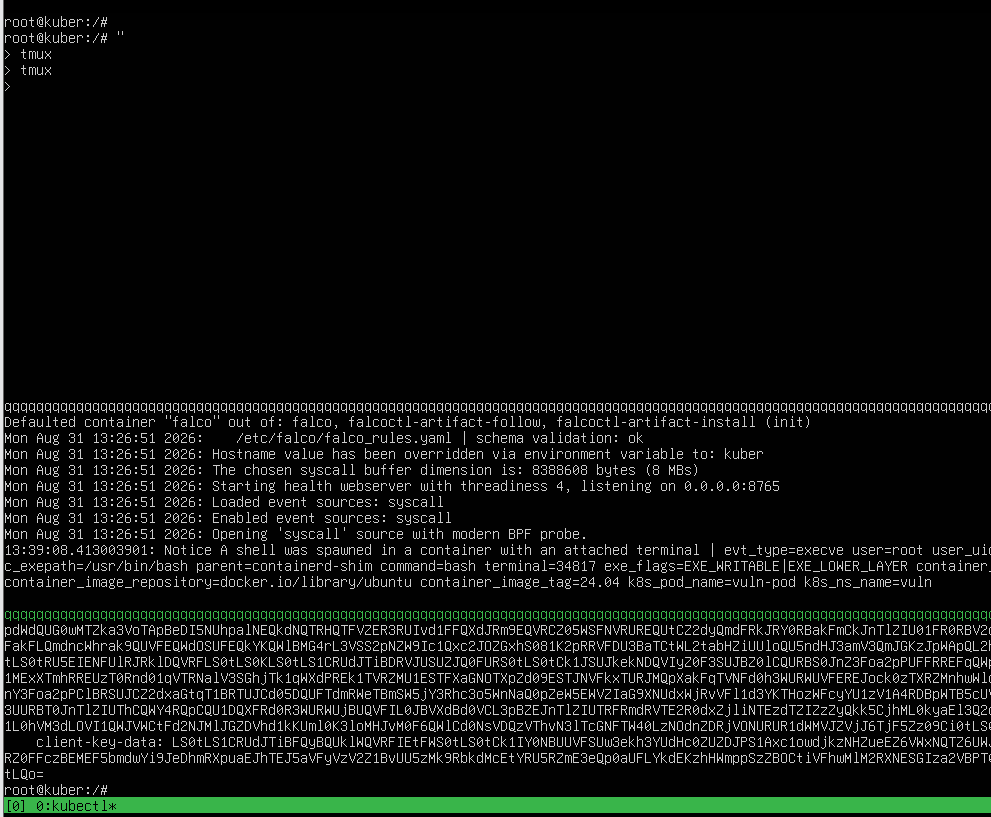
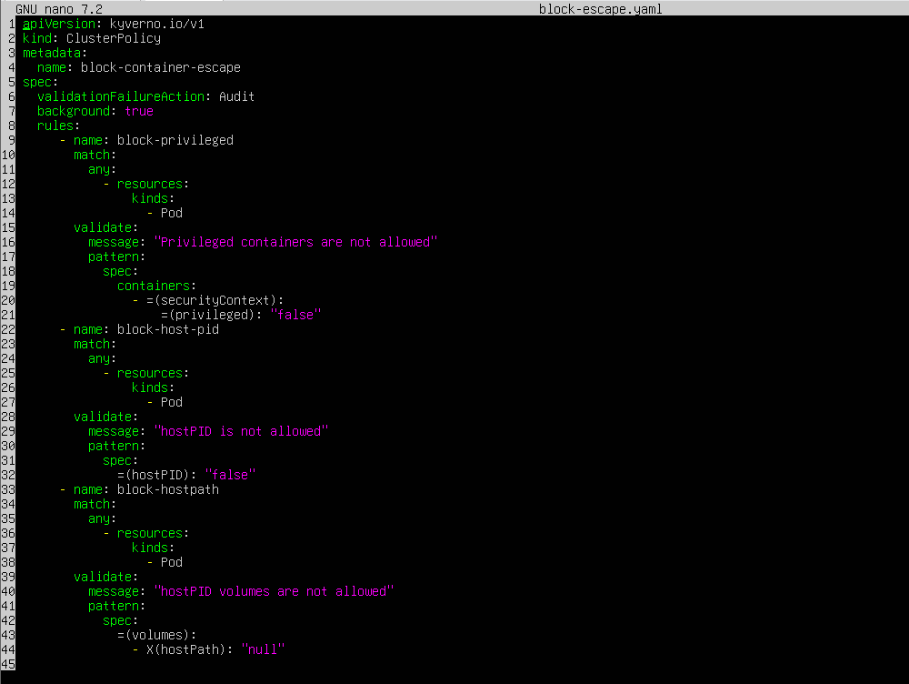
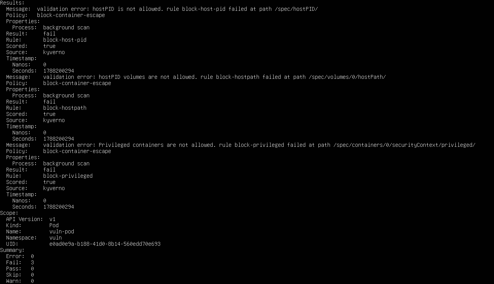
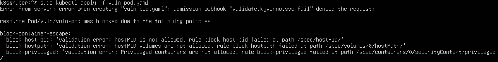

# Kubernetes Attack & Defend — Container Security Lab

## Overview
A hands-on container-security lab built on a single-node k3s cluster running in VMware. The project walks the full security lifecycle on a real cluster: a deliberately misconfigured pod is used to escape its container and pivot to full cluster-admin, the same break-in is then caught in real time with Falco, and finally blocked outright with a Kyverno admission policy. The complete arc is **land → recon → escape → cluster-admin → detect → prevent**, with every phase validated on the live cluster.



## Infrastructure

| Component       | Detail                                                              |
|-----------------|--------------------------------------------------------------------|
| Host OS         | Ubuntu Server 24.04 LTS (VM in VMware, NAT)                         |
| Cluster         | k3s single-node — `curl -sfL https://get.k3s.io \| sh -`            |
| Package manager | Helm 3                                                              |
| Namespace       | `vuln` (the target workload)                                        |
| Falco           | `falcosecurity/falco` chart · `driver.kind=modern_ebpf` (detection)|
| Kyverno         | `kyverno/kyverno` chart · admission webhook (prevention)           |

Everything runs on one Ubuntu node. The vulnerable pod is scheduled into the `vuln` namespace; Falco installs cluster-wide and watches the Linux kernel via an eBPF syscall probe, while Kyverno registers as an admission webhook that vets every pod **before** it is allowed to run.

## Features
- Full container-escape chain: privileged pod → node root filesystem → cluster-admin
- Three stacked misconfigurations demonstrated and explained (`privileged`, `hostPID`, `hostPath:/`)
- Real-time runtime detection with Falco using a modern eBPF probe
- Prevention-as-code: a single Kyverno ClusterPolicy that blocks all three misconfigs at admission
- Best-practice rollout — policy run in **Audit** mode first, reviewed, then flipped to **Enforce**
- Optional continuous scanning with Trivy Operator (vulnerability + misconfiguration reports)

## Tools Used
- k3s (Kubernetes v1.36)
- Helm 3
- Falco (modern eBPF driver)
- Kyverno
- kubectl
- Ubuntu Server 24.04 LTS
- VMware Workstation

## Security Controls

**Attack — the three misconfigurations that enabled the escape**

| Misconfiguration   | Role in the escape                                         |
|--------------------|-----------------------------------------------------------|
| `privileged: true` | Grants the capabilities needed to `chroot` onto the node  |
| `hostPath: /`      | Mounts the node's entire root filesystem at `/host`       |
| `hostPID: true`    | Full visibility into the host process tree                |

**Defense — the Kyverno ClusterPolicy that blocks it**

| Rule               | Blocks                                              |
|--------------------|----------------------------------------------------|
| `block-privileged` | Any container with `securityContext.privileged`    |
| `block-host-pid`   | Any pod requesting `hostPID: true`                 |
| `block-hostpath`   | Any pod mounting a `hostPath` volume               |

## Setup Guide

### Prerequisites
```bash
# k3s
curl -sfL https://get.k3s.io | sh -

# kubeconfig for a non-root user
mkdir -p ~/.kube
sudo cp /etc/rancher/k3s/k3s.yaml ~/.kube/config
sudo chown $(id -u):$(id -g) ~/.kube/config
export KUBECONFIG=~/.kube/config

# Helm
curl https://raw.githubusercontent.com/helm/helm/main/scripts/get-helm-3 | bash

# Namespace
kubectl create namespace vuln
```

### 1. The Vulnerable Pod (`vuln-pod.yaml`)
```yaml
apiVersion: v1
kind: Pod
metadata:
  name: vuln-pod
  namespace: vuln
spec:
  hostPID: true
  hostNetwork: true
  containers:
    - name: vuln
      image: ubuntu:24.04
      command: ["/bin/sleep", "infinity"]
      securityContext:
        privileged: true
      volumeMounts:
        - name: host-root
          mountPath: /host
  volumes:
    - name: host-root
      hostPath:
        path: /
        type: Directory
```
```bash
kubectl apply -f vuln-pod.yaml
```

### 2. The Escape Chain
```bash
# 1. Land — shell into the pod
kubectl exec -it vuln-pod -n vuln -- /bin/bash

# 2. Recon — the node's root filesystem is exposed inside the pod
ls /host

# 3. Escape — chroot onto the node as root
chroot /host /bin/bash

# 4. Pivot — steal the cluster kubeconfig, become cluster-admin
export KUBECONFIG=/etc/rancher/k3s/k3s.yaml
kubectl get nodes
kubectl auth can-i '*' '*' --all-namespaces   # → yes
```

### 3. Detection with Falco
```bash
helm repo add falcosecurity https://falcosecurity.github.io/charts
helm repo update
helm install falco falcosecurity/falco \
  --namespace falco --create-namespace \
  --set driver.kind=modern_ebpf --set tty=true

kubectl get pods -n falco -w
kubectl logs -n falco -l app.kubernetes.io/name=falco -f
```
Re-running the escape makes Falco fire in real time:
```
Notice A shell was spawned in a container with an attached terminal
  evt_type=execve user=root c_exepath=/usr/bin/bash parent=containerd-shim
  k8s_pod_name=vuln-pod k8s_ns_name=vuln
```

### 4. Prevention with Kyverno (`block-escape.yaml`)
```bash
helm repo add kyverno https://kyverno.github.io/kyverno/
helm repo update
helm install kyverno kyverno/kyverno --namespace kyverno --create-namespace
```
```yaml
apiVersion: kyverno.io/v1
kind: ClusterPolicy
metadata:
  name: block-container-escape
spec:
  validationFailureAction: Enforce   # start in Audit, then flip to Enforce
  rules:
    - name: block-privileged
      match: { resources: { kinds: [Pod] } }
      validate:
        message: "Privileged containers are not allowed."
        pattern: { spec: { containers: [ { =(securityContext): { =(privileged): false } } ] } }
    - name: block-host-pid
      match: { resources: { kinds: [Pod] } }
      validate:
        message: "hostPID is not allowed."
        pattern: { spec: { =(hostPID): false } }
    - name: block-hostpath
      match: { resources: { kinds: [Pod] } }
      validate:
        message: "hostPath volumes are not allowed."
        pattern: { spec: { =(volumes): [ { =(hostPath): "null" } ] } }
```
```bash
# Audit first — allowed but logged
sed -i 's/Enforce/Audit/' block-escape.yaml && kubectl apply -f block-escape.yaml
kubectl get policyreport -A

# Flip to Enforce — the bad pod is now rejected at admission
sed -i 's/Audit/Enforce/' block-escape.yaml && kubectl apply -f block-escape.yaml
kubectl delete pod vuln-pod -n vuln
kubectl apply -f vuln-pod.yaml   # → BLOCKED
```
Expected rejection:
```
Error from server: admission webhook "validate.kyverno.svc-fail" denied the request:
  resource Pod/vuln/vuln-pod was blocked due to the following policies
  block-container-escape:
    block-host-pid:   hostPID is not allowed.
    block-hostpath:   hostPath volumes are not allowed.
    block-privileged: Privileged containers are not allowed.
```

## Screenshots

### k3s Single-Node Cluster Running


### Vulnerable Pod Manifest — privileged + hostPID + hostPath


### Container Escape — Node Root Filesystem Exposed at /host


### Falco Alert — Shell Spawned in Container (detected live)


### Kyverno ClusterPolicy — block-privileged / host-pid / hostpath


### Audit-Mode Policy Report — 3 violations flagged


### Pod Rejected at Admission — escape blocked


## Author
Mohamed abdelli
